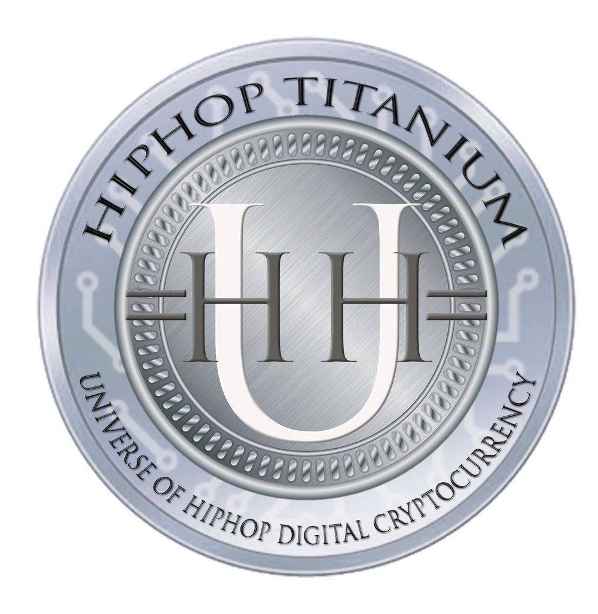

# UHHT Hip Hop Titanium ERC20 TOKEN

_UHHT  Hip Hop Titanium holders will receive all the benefits included in the entire UHH Crypto Suite (UHH, UHHP, UHHB, UHHV)_

The popular cryptocurrency and blockchain system Ethereum is based on the use of tokens, which can be bought, sold, or traded. Ethereum was launched in 2015, and since then it has become one of the driving forces behind the popularity of cryptocurrency. In the Ethereum system, tokens represent a diverse range of digital assets, such as vouchers, IOUs, or even real-world, tangible objects. Ethereum tokens are smart contracts that make use of the Ethereum blockchain. ERC-20 is similar, in some respects, to bitcoin, Litecoin, and any other cryptocurrency; ERC-20 tokens are blockchain-based assets that have value and can be sent and received. The primary difference is that instead of running on their own blockchain, ERC-20 tokens are issued on the Ethereum network.

### What is an ERC20 token?
An ERC20 token is a blockchain-based asset with similar functionality to bitcoin, ether, and bitcoin cash: it can hold value and be sent and received. The major difference between ERC20 tokens and other cryptocurrencies is that ERC20 tokens are created and hosted on the Ethereum blockchain, whereas bitcoin and bitcoin cash are the native currencies of their respective blockchains. ERC20 tokens are stored and sent using Ethereum addresses and transactions, and use gas to cover transaction fees.

More than 200,000 ERC-20-compatible tokens exist on Ethereum's main network. The ERC-20 commands vital importance; it defines a common list of rules that all Ethereum tokens must adhere to. Some of these rules include how the tokens can be transferred, how transactions are approved, how users can access data about a token, and the total supply of tokens. 

ERC20 is an official protocol for proposing improvements to the Ethereum (ETH) network. ERC stands for Ethereum Request for Comment, and 20 is the proposal identifier. This is a common standard for creating tokens on the Ethereum blockchain. This token standard defines a set of rules that apply to all ERC20 tokens that allow them to interact seamlessly with one another. Wallets and exchanges use the standard to integrate various ERC20 tokens onto their platforms and facilitate exchanges between ERC20 tokens and other cryptocurrencies.
